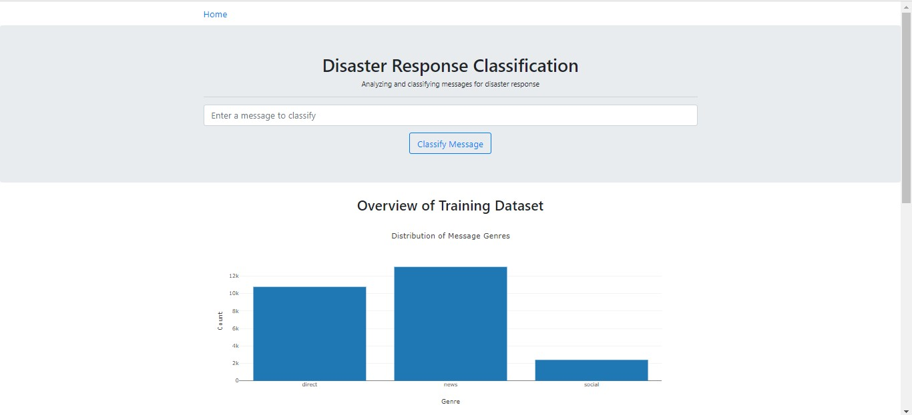
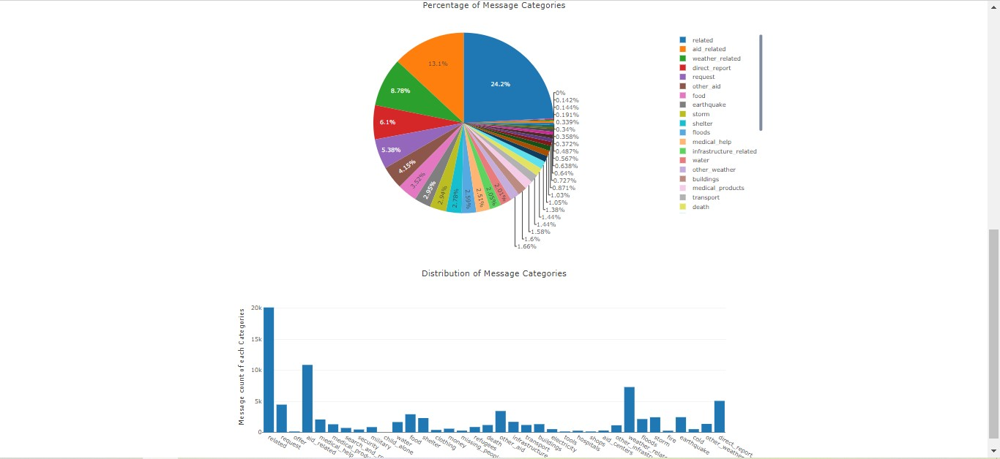
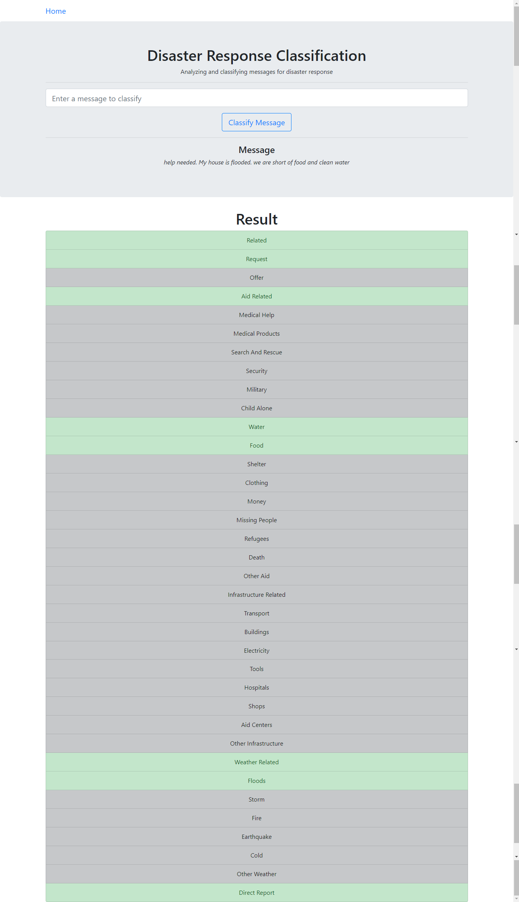

# Disaster-Response-Classification

## Table of Contents
1. [Description](#description)
2. [Motivation](#motivation)
3. [Getting Started](#getting_started)
    1. [Dependencies](#dependencies)
    2. [Installing](#installing)
    3. [Executing Program](#executing)
4. [Acknowledgement](#acknowledgement)
5. [Screenshots](#screenshots)

<a name="descripton"></a>
## Description
This project is part of Data Scientist Nanodegree Program by Udacity in collaboration with Figure Eight.
The initial dataset contains pre-labelled tweet and messages from real-life disaster. 
The aim of the project is to build a Natural Language Processing tool that categorize messages.

The project is divided in the following Sections:

1. Data Processing, ETL Pipeline to extract data from source, clean data and save them in a proper database structure
2. Machine Learning Pipeline to train a model able to classify text message in categories
3. Web App to show model results in real time.

<a name="motivation"></a>
## Project Motivation
Following a disaster, there are a number of different problems that may arise. Different types of disaster response 
organizations take care of different parts of the disasters and observe messages to understand the needs of the 
situation. They have the least capacity to filter out messages during a large disaster, so predictive modeling can help 
classify different messages more efficiently. This is where a project like this can help. This will classify incoming
 messages into categories so that first responder and organisations can prioritize help to people who need it the most.

<a name="getting_started"></a>
## Getting Started

<a name="dependencies"></a>
### Dependencies
* Python 3.7 (Anaconda preferred)
* Machine Learning Libraries: NumPy, SciPy, Pandas, Sciki-Learn
* Natural Language Process Libraries: NLTK
    * NLTK specific libraries: punkt, wordnet, averaged_perceptron_tagger
* SQLlite Database Libraqries: SQLalchemy
    * You may also need to get SQLlite related driver files.
* Web App and Data Visualization: Flask, Plotly

<a name="installing"></a>
### Installing
* Clone this repository:

```commandline
git clone git@github.com:agpt8/Disaster-Response-Classificatio.git
```

* Go into this directory and install the dependencies

```commandline
cd Disaster-Response-Classification

conda env create -f environment.yml
```
* If you don't have conda installed, isntall the dependencies with the following command

```commandline
pip install scikit-learn=0.19 numpy pandas flask plotly nltk scipy sqlalchemy 
```

* You need to install a specific version of scikit-learn (shown above) as later versions of the library throws a
 specific attribute error regarding deprecation script.

<a name="executing"></a>
### Executing Program:
1. Run the following commands in the project's root directory to set up your database and model (the order of the
 arguments is important).

    - To run ETL pipeline that cleans data and stores in database
        
        ```commandline
      python data/process_data.py data/disaster_messages.csv data/disaster_categories.csv data/DisasterResponse.db
      ```
    
    - To run ML pipeline that trains classifier and saves
        
        ```commandline
      python models/train_classifier.py data/DisasterResponse.db models/classifier.pkl
      ```  
      
    - If you get an error during any of the above reagrding nltk module not found, refer 
    [this](https://www.nltk.org/data.html), to download the modules manually.
    
    - The training could take several hours. On my PC, it took ~9 hours to train the model. If you just want to test
     this, feel free to use the included model.

2. Run the following command to start the web app.
    `python app/run.py`
    
    * If during running the app, if you run into error saying model not found in `joblib.load(model/classifier.pkl
    )`, try using absolute path of the model here. Python some times fail to use relative paths. Also, if the
     absolute path has backslash `"\"`, don't forget to escape it (`\\`). 

3. Go to http://127.0.0.1:3001/

<a name="acknowledgement"></a>
## Acknowledgements

* [Udacity](https://www.udacity.com/) for providing such a complete Data Science Nanodegree Program
* [Figure Eight](https://www.figure-eight.com/) for providing messages dataset to train my model

<a name="screenshots"></a>
## Screenshots
Screenshot of the APP:



